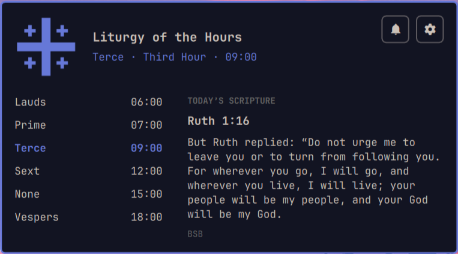

# Liturgy of the Hours for Omarchy

An Omarchy Quattro bar widget for the canonical hours. A Jerusalem Cross sits in the bar; click it for today’s hours with the current office highlighted, and today’s Scripture from the Berean Standard Bible.



Plugin id: `io.github.mohuddle.liturgy-of-the-hours`

## What it does

- Shows a theme-colored Jerusalem Cross in the Omarchy bar (accent-colored while an hour is current).
- Lists Lauds, Prime, Terce, Sext, None, and Vespers, highlighting the current hour.
- Rotates a curated BSB passage once per local calendar day.
- Sends one Omarchy notification at each enabled hour (with a five-minute grace window). Hour toasts stay on screen until you click them or the Jerusalem Cross, and a church bell rings when they appear.
- Bell beside the gear opens a brief office for the current hour: the liturgical day, the chapter, the short respond, a collect for the day and hour, and a memorial collect. That toast replaces the hour reminder and stays until you dismiss it.
- Remembers reminder state at `~/.local/state/omarchy/settings/liturgy-of-the-hours.json` (mode `0600`) through a small Python helper. Bundled `data/verses.json` and `data/office.json` are read the same way.

The plugin does not overwrite `~/.config/omarchy/shell.json` except to add or update its own bar-widget entry when you enable it or change its settings. No sudo or pkexec is required. There is no translation picker; Scripture is always BSB.

## Hours and default times

| Hour | Latin | Traditional | Default |
|------|-------|-------------|---------|
| Morning Prayer | Laudes | Dawn | 06:00 |
| Prime | Prima | First Hour | 07:00 |
| Terce | Tertia | Third Hour | 09:00 |
| Sext | Sexta | Sixth Hour | 12:00 |
| None | Nona | Ninth Hour | 15:00 |
| Evening Prayer | Vesperae | Sunset | 18:00 |

Prime is 07:00 by default so it does not collide with Morning Prayer. Every hour can be enabled, disabled, or retimed from the panel gear.

## Sources and attribution

Daily Scripture is the [Berean Standard Bible](https://berean.bible/terms.htm) (CC0), bundled in `data/verses.json`. Office chapters in `data/office.json` are BSB; collects and memorials are 1662/1928 public-domain texts. Liturgical day names follow the traditional 1662/1928/REC calendar. No API key and no runtime network request. See [NOTICE.md](NOTICE.md).

## Install

```bash
omarchy plugin add https://github.com/mohuddle/omarchy-liturgy-of-the-hours.git --enable
```

The widget is added to the right bar section. To move it:

```bash
omarchy bar move io.github.mohuddle.liturgy-of-the-hours --section center
```

## Usage

- **Left click:** open or close the panel, and dismiss any hour reminder still on screen.
- **Middle click:** reload today’s Scripture from the bundled catalogue.
- **Right click:** send today’s Scripture as a desktop notification.
- With the popup open: `Esc` closes it, `r` reloads Scripture, `Tab`/`Shift+Tab` switches to the neighboring bar panel.
- Gear: hour times, which hours to keep, and reminder on/off.
- Bell: dismiss the hour reminder and open The Office (also sent as a persistent toast).

## Dependencies

- Omarchy Quattro (`omarchy-shell`)

No extra packages are installed. No sudo or pkexec is required. No network access is required.

## Remove

```bash
omarchy plugin remove io.github.mohuddle.liturgy-of-the-hours
```

That disables the widget and deletes the plugin checkout. Reminder state is kept at:

```
~/.local/state/omarchy/settings/liturgy-of-the-hours.json
```

Removal does not touch other Omarchy configuration.

## Development checks

```bash
omarchy plugin validate .
node tests/model.test.js
python3 tests/test_store.py
```

## License

MIT. See [LICENSE](LICENSE). BSB text is CC0; see [NOTICE.md](NOTICE.md).
